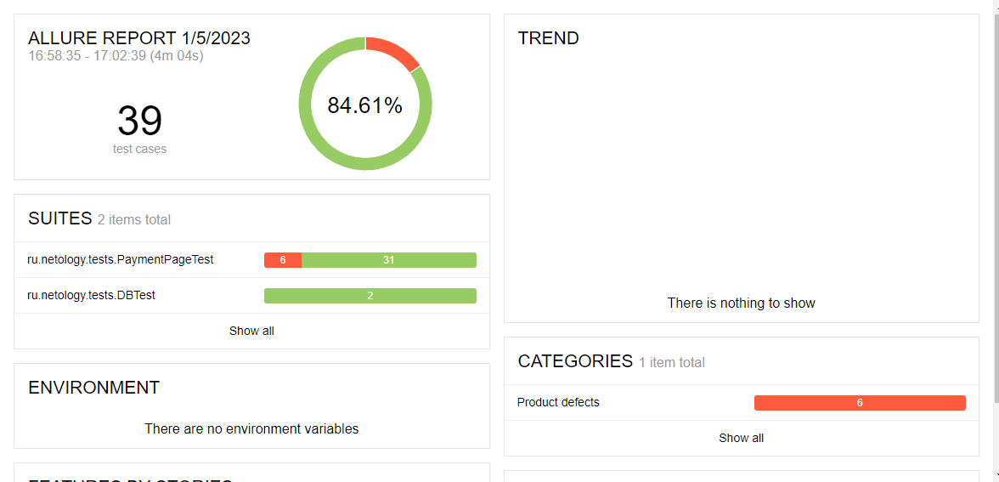

# Отчёт по итогам тестирования   
## Краткое описание
В ходе автоматизации тестирования были реализованы позитивные и негативные сценарии заполнения формы покупки тура

Реализована поддержка БД MySQL

Автоматизация тестирования сервиса "Путешествие дня" выполнялась с использованием следующих инструментов:

- IntelliJ IDEA Community Edition 2022.2.2
- Java 11
- Docker Desktop
- Браузер Chrome и chromedriver
- GitHub
- junit-jupiter:5.8.1
- selenide:5.19.0
- allure:2.16.1
- faker 1.0.2    
- Для работы с БД и симулятором банковских сервисов использовался docker   

*Были протестированы следующие сценарии:*

- Успешная покупка с дебетовой и кредитной карты
- Отказ банка с дебетовой и кредитной картой
- Негативные проверки полей: невалидные значения, незаполненные поля
- Проверка записи данных в БД при использовании MySQL

**Количество тестов**

Всего: 39 тестов

Успешных: 33 (84,61%)
Неуспешных: 6 (15,39%) - дефекты продукта

### Общие рекомендации 

**Найденные дефекты:**

1. Опечатка в названии города Марракеш
2. При вводе месяца одной цифрой автоматически не дописывается ноль впереди
3. Поле "Месяц" принимает значение "00"
4. Оплата отклоненной картой проходит успешно
5. Поле "Владелец" принимает значение кириллицей   
6. Поле "Владелец" принимает значение с цифрами
7. Поле "Владелец" принимает имя со спецсимволами   

**Рекомендации по улучшению** 

1. Релизовать добавление нуля при заполнение поля месяц одной цифрой   
2. Во всех случаях, когда поля формы остаются пустыми, выводить предупреждающую надпись "Поле обязательно для заполнения" вместо "Неверный формат".    
На данный момент тестирование организовано с учетом имеющихся сообщений об ошибках.   
3. Рассмотреть вариант сохранения данных в анкете при переключении между "Купить" и "Купить в кредит". Сейчас анкета очищается каждый раз.